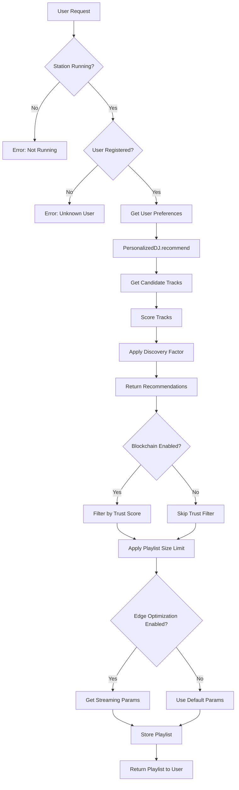
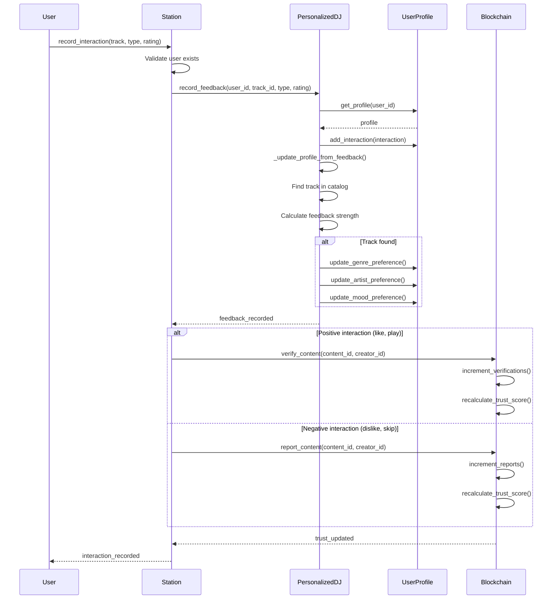
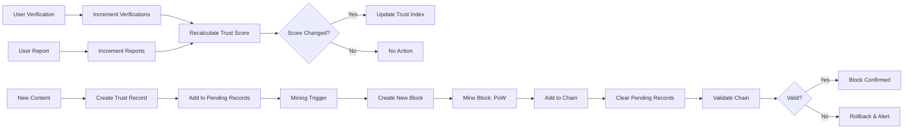
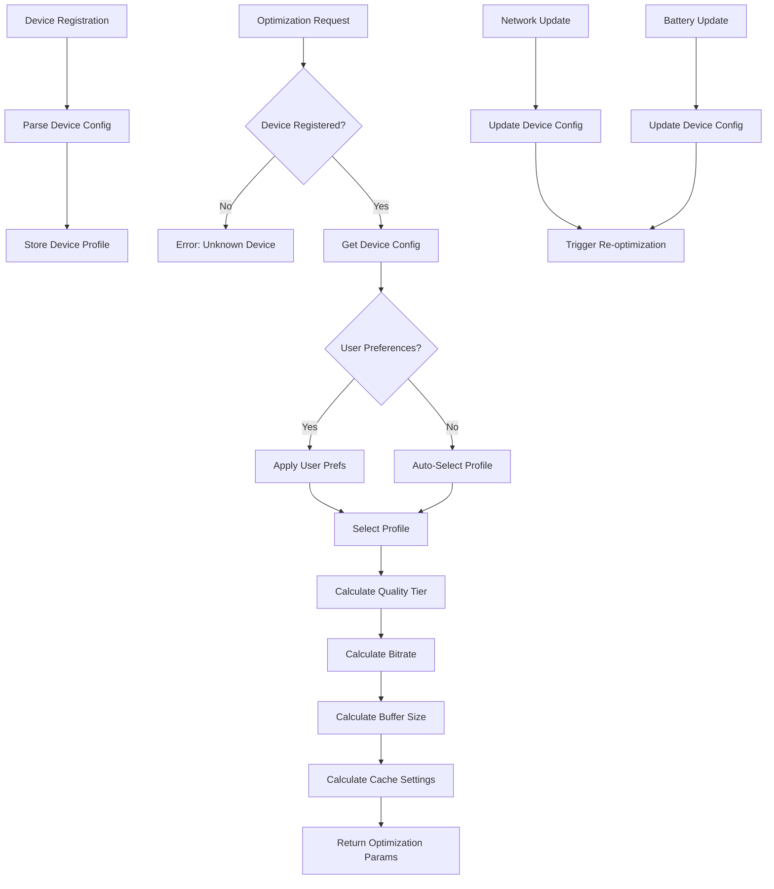
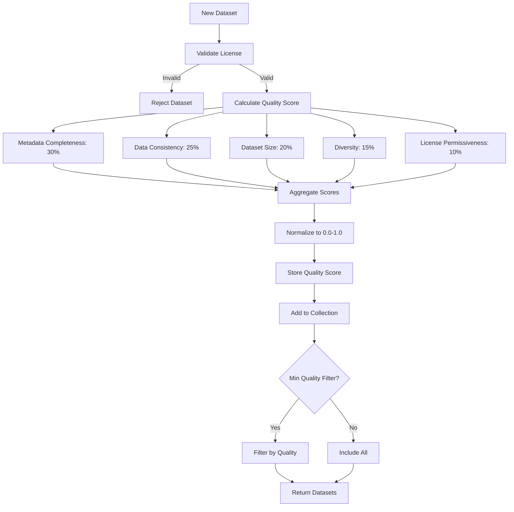

# Data Flow and Interactions

This document details the data flows and component interactions within QFZZ.

## Overview

QFZZ processes data through multiple pathways, each optimized for specific operations. Understanding these flows is crucial for system optimization and debugging.

## Core Data Flows

### 1. Playlist Generation Flow

The most common operation in QFZZ.



#### Detailed Steps

**Phase 1: Request Validation**
```python
# 1. Check station state
if not station._running:
    raise RuntimeError("Station is not running")

# 2. Check user registration
if user_id not in station._listeners:
    raise ValueError("User not found")

# 3. Get user preferences
user_data = station._listeners[user_id]
preferences = user_data.get('preferences', {})
```

**Phase 2: Recommendation Generation**
```python
# 4. Request recommendations from DJ
recommendations = dj.recommend(user_id, preferences)

# Steps within DJ:
# 4a. Get or create user profile
profile = dj.get_or_create_profile(user_id, preferences)

# 4b. Get candidate tracks
candidates = dj._get_candidate_tracks(profile)

# 4c. Score each candidate
scored_tracks = []
for track in candidates:
    score = dj._calculate_track_score(track, profile, preferences)
    scored_tracks.append((score, track))

# 4d. Sort by score
scored_tracks.sort(key=lambda x: x[0], reverse=True)

# 4e. Apply discovery factor
recommendations = dj._apply_discovery(scored_tracks, profile.discovery_factor)
```

**Phase 3: Trust Filtering (Optional)**
```python
# 5. Filter by trust threshold
if station._trust_network:
    recommendations = [
        track for track in recommendations
        if trust_network.get_trust_score(
            track.get('content_id'),
            track.get('creator_id')
        ) >= config.trust_threshold
    ]
```

**Phase 4: Finalization**
```python
# 6. Limit playlist size
playlist = recommendations[:config.max_playlist_size]

# 7. Store playlist
station._listeners[user_id]['playlist'] = playlist

# 8. Return to user
return playlist
```

#### Performance Characteristics

| Step | Complexity | Typical Time |
|------|-----------|-------------|
| Validation | O(1) | <1ms |
| Profile Lookup | O(1) | <1ms |
| Candidate Retrieval | O(1) | <5ms |
| Track Scoring | O(n) | 10-50ms |
| Sorting | O(n log n) | 5-20ms |
| Trust Filtering | O(m) | 5-15ms |
| **Total** | **O(n log n)** | **20-100ms** |

*where n = catalog size, m = recommendations*

---

### 2. Feedback Processing Flow

User interactions update profiles and trust scores.



#### Feedback Strength Mapping

```python
FEEDBACK_STRENGTH = {
    'play': 0.05,      # Implicit positive signal
    'skip': -0.05,     # Implicit negative signal
    'like': 0.1,       # Explicit positive
    'dislike': -0.1,   # Explicit negative
    'favorite': 0.2,   # Strong positive
    'rate': lambda r: (r - 0.5) * 0.2  # Scaled rating
}
```

#### Profile Update Algorithm

```python
def update_preference(current_weight, strength):
    """Update preference weight based on feedback."""
    new_weight = current_weight + strength
    return max(0.0, min(1.0, new_weight))  # Clamp to [0, 1]
```

---

### 3. Trust Network Flow

Blockchain operations for content verification.



#### Trust Score Calculation

```python
def calculate_trust_score(verifications, reports):
    """
    Calculate trust score from verifications and reports.
    
    Score = verifications / (verifications + reports)
    
    - All verifications: 1.0
    - All reports: 0.0
    - No feedback: 0.5 (neutral)
    """
    if verifications + reports == 0:
        return 0.5  # Neutral default
    
    return verifications / (verifications + reports)
```

#### Mining Process

```python
def mine_block(block, difficulty):
    """
    Mine block using Proof-of-Work.
    
    Find nonce such that hash starts with 'difficulty' zeros.
    """
    target = "0" * difficulty
    
    while not block.hash.startswith(target):
        block.nonce += 1
        block.hash = block.calculate_hash()
    
    return block
```

**Difficulty Scaling**:
- Difficulty 1: ~10 iterations (instant)
- Difficulty 2: ~100 iterations (<1ms)
- Difficulty 3: ~1000 iterations (~10ms)
- Difficulty 4: ~10000 iterations (~100ms)

---

### 4. Edge Optimization Flow

Device-aware streaming parameter calculation.



#### Profile Selection Logic

```python
def select_profile(device, preferences):
    """Select optimization profile."""
    # 1. Check user preference
    if preferences and 'profile' in preferences:
        return preferences['profile']
    
    # 2. Battery-based selection
    if device.battery_powered and device.battery_level < 0.3:
        return 'power_save'
    
    # 3. Network-based selection
    if device.network_type in [NetworkType.CELLULAR_3G, NetworkType.CELLULAR_4G]:
        return 'bandwidth_save'
    
    if device.bandwidth_mbps < 1.0:
        return 'bandwidth_save'
    
    # 4. Quality-based selection
    if device.bandwidth_mbps >= 5.0 and device.device_type == DeviceType.DESKTOP:
        return 'quality'
    
    # 5. Default
    return 'balanced'
```

#### Bitrate Calculation

```python
def calculate_bitrate(device, profile, quality):
    """Calculate optimal bitrate."""
    # Base bitrates
    QUALITY_BITRATES = {
        'low': 96,
        'medium': 128,
        'high': 256,
        'lossless': 320
    }
    
    base_bitrate = QUALITY_BITRATES[quality]
    
    # Apply limits
    profile_limit = profile['max_bitrate_kbps']
    device_limit = device.max_bitrate_kbps
    bandwidth_limit = int(device.bandwidth_mbps * 1024 * 0.8)
    
    # Return minimum of all limits
    return min(base_bitrate, profile_limit, device_limit, bandwidth_limit)
```

---

### 5. Dataset Management Flow

Quality scoring and validation.



#### Quality Scoring Details

**Metadata Completeness** (30%)
```python
def score_metadata(dataset):
    required = ['title', 'artist', 'genre', 'duration']
    optional = ['album', 'year', 'mood', 'energy', 'tempo']
    
    score = 0.0
    for track in dataset.tracks:
        # Required fields: 70% of score
        req_score = sum(1 for f in required if f in track and track[f])
        score += (req_score / len(required)) * 0.7
        
        # Optional fields: 30% of score
        opt_score = sum(1 for f in optional if f in track and track[f])
        score += (opt_score / len(optional)) * 0.3
    
    return score / len(dataset.tracks)
```

**Data Consistency** (25%)
```python
def score_consistency(dataset):
    # Field consistency
    sample_fields = set(dataset.tracks[0].keys())
    field_consistency = 0.0
    
    for track in dataset.tracks:
        overlap = len(sample_fields & set(track.keys())) / len(sample_fields)
        field_consistency += overlap
    
    field_consistency /= len(dataset.tracks)
    
    # Value validity
    valid_values = 1.0
    for track in dataset.tracks:
        if 'duration' in track and track['duration'] <= 0:
            valid_values -= 0.01
        if 'energy' in track and not 0.0 <= track['energy'] <= 1.0:
            valid_values -= 0.01
    
    return (field_consistency * 0.5 + max(0, valid_values) * 0.5)
```

---

## Data Storage Patterns

### In-Memory Storage

**User Profiles**
```python
_user_profiles: Dict[str, UserProfile] = {}
```

**Trust Index**
```python
_trust_index: Dict[str, TrustRecord] = {}  # key: "content_id:creator_id"
```

**Device Registry**
```python
_devices: Dict[str, EdgeDeviceConfig] = {}
```

### Blockchain Storage

**Linear Chain**
```python
_chain: List[Block] = [genesis_block, block_1, block_2, ...]
```

**Pending Records**
```python
_pending_records: List[TrustRecord] = []
```

---

## Caching Strategies

### Profile Caching

User profiles persist in memory for fast access:
- Created on first use
- Updated incrementally
- Never evicted during session

### Trust Score Caching

Trust scores indexed for O(1) lookup:
- Updated on verification/report
- Recalculated when block mined
- No TTL (immutable on chain)

### Content Catalog Caching

Track catalog maintained in memory:
- Loaded on startup
- Updated when datasets added
- LRU eviction possible (future)

---

## Error Handling Flows

### Invalid User Request

```python
try:
    playlist = station.generate_playlist("unknown_user")
except ValueError as e:
    logger.error(f"Invalid user: {e}")
    return error_response("User not found")
```

### Station Not Running

```python
if not station.is_running():
    raise RuntimeError("Station must be started first")
```

### Trust Network Validation Failure

```python
if not trust_network.is_chain_valid():
    logger.critical("Blockchain validation failed!")
    # Trigger chain repair or rollback
    trust_network.repair_chain()
```

---

## Performance Optimization

### Batch Operations

Group operations for efficiency:
```python
# Bad: Individual operations
for track in tracks:
    dataset.add_track(track)

# Good: Batch operation
dataset.add_tracks(tracks)  # Single operation
```

### Lazy Loading

Components initialized only when needed:
```python
def _initialize_components(self):
    # Always needed
    self._dj = PersonalizedDJ()
    
    # Conditional
    if self.config.enable_blockchain:
        self._trust_network = BlockchainTrustNetwork()  # Only if enabled
```

### Index Maintenance

Maintain indexes for fast lookups:
```python
# Trust index for O(1) lookups
self._trust_index[f"{content_id}:{creator_id}"] = record

# Profile index
self._user_profiles[user_id] = profile
```

---

## Monitoring Points

Key metrics to monitor:

1. **Playlist Generation Time**: Should be <100ms
2. **Trust Score Lookup**: Should be <1ms
3. **Profile Update Time**: Should be <5ms
4. **Block Mining Time**: Depends on difficulty
5. **Device Optimization**: Should be <10ms

---

**Next**: [Features →](../features/personalized-dj.md) | [API Reference →](../api-reference/station.md)
