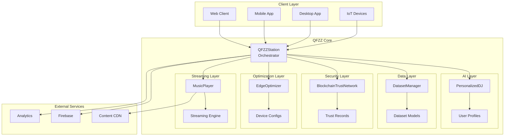
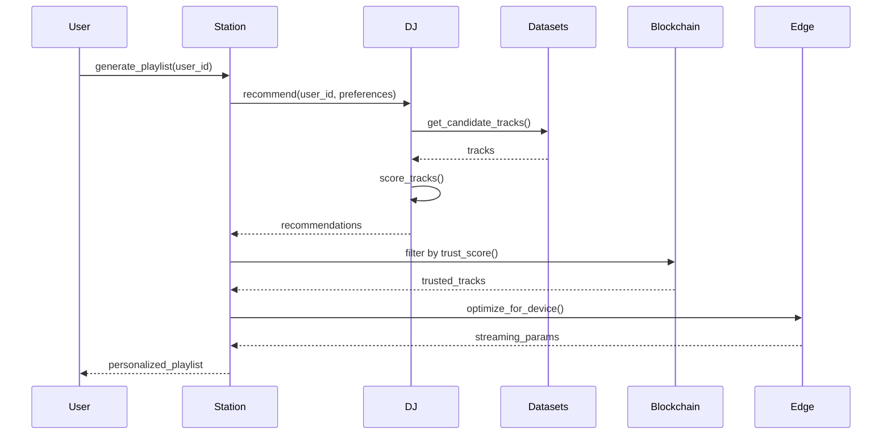
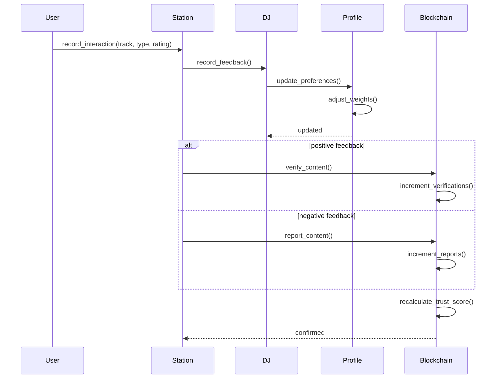
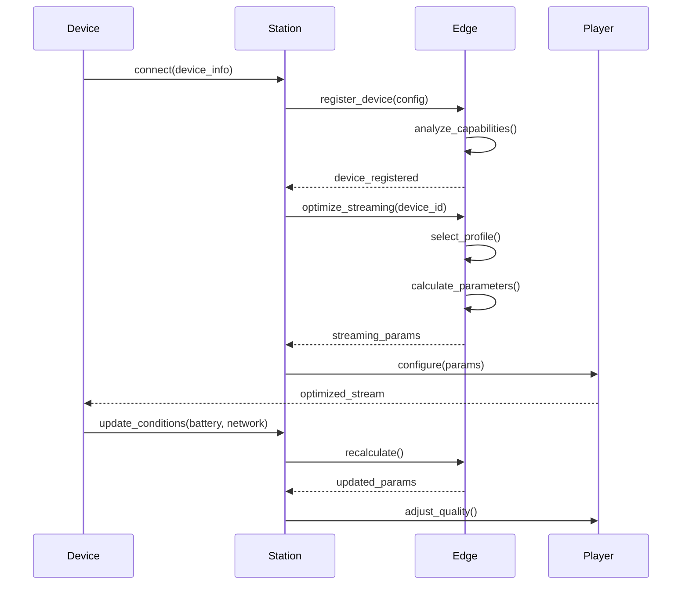
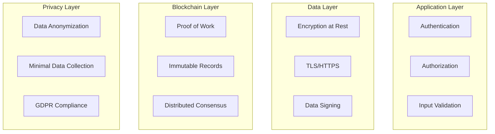
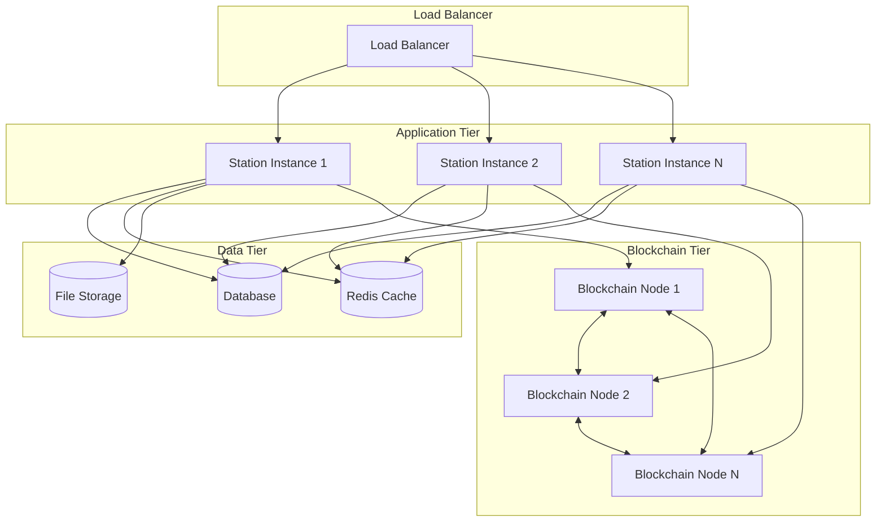

# Architecture Overview

QFZZ is designed as a modular, scalable platform for personalized radio broadcasting. This document provides a high-level overview of the system architecture.

## Design Philosophy

### Core Principles

1. **Modularity**: Each component is independent and replaceable
2. **Extensibility**: Easy to add new features and capabilities
3. **Type Safety**: Full type annotations for reliability
4. **Simplicity**: Clean, understandable code structure
5. **Performance**: Optimized for real-time streaming and recommendations

### Architectural Patterns

- **Orchestrator Pattern**: `QFZZStation` coordinates all components
- **Strategy Pattern**: Pluggable algorithms for recommendations and optimization
- **Repository Pattern**: Dataset and blockchain storage abstraction
- **Observer Pattern**: Event-driven feedback and updates

## System Architecture

### High-Level View



## Component Overview

### QFZZStation (Orchestrator)

**Purpose**: Central coordinator that manages all components and user interactions.

**Responsibilities**:
- Component lifecycle management
- User session management
- Playlist generation coordination
- Configuration management
- Statistics and monitoring

**Key Interfaces**:
```python
class QFZZStation:
    def start() -> None
    def stop() -> None
    def add_listener(user_id, preferences) -> None
    def generate_playlist(user_id) -> List[Track]
    def record_interaction(user_id, track_id, type) -> None
    def get_station_stats() -> Dict
```

[Learn more →](../api-reference/station.md)

### PersonalizedDJ (AI Layer)

**Purpose**: AI-powered recommendation engine with user profiling.

**Responsibilities**:
- User preference learning
- Playlist generation
- Recommendation scoring
- Feedback processing
- Discovery balance

**Key Features**:
- Multi-dimensional taste profiling
- Genre similarity mapping
- Discovery factor tuning
- Real-time adaptation

[Learn more →](../features/personalized-dj.md) | [API Reference →](../api-reference/dj.md)

### DatasetManager (Data Layer)

**Purpose**: Manages music datasets with quality scoring and validation.

**Responsibilities**:
- Dataset registration
- Quality assessment
- License validation
- Metadata management
- Track cataloging

**Quality Metrics**:
- Metadata completeness (30%)
- Data consistency (25%)
- Dataset size (20%)
- Diversity (15%)
- License permissiveness (10%)

[Learn more →](../features/dataset-management.md) | [API Reference →](../api-reference/datasets.md)

### BlockchainTrustNetwork (Security Layer)

**Purpose**: Immutable content verification and trust scoring.

**Responsibilities**:
- Trust record creation
- Block mining
- Chain validation
- Trust score calculation
- Creator reputation tracking

**Key Features**:
- Proof-of-work consensus
- Tamper-proof records
- Dynamic trust scoring
- Community verification

[Learn more →](../features/quantum-security.md) | [API Reference →](../api-reference/blockchain.md)

### EdgeOptimizer (Optimization Layer)

**Purpose**: Device-aware streaming optimization.

**Responsibilities**:
- Device profiling
- Network adaptation
- Quality adjustment
- Battery management
- Cache optimization

**Optimization Profiles**:
- Power save
- Balanced
- Quality
- Bandwidth save

[Learn more →](../features/edge-optimization.md) | [API Reference →](../api-reference/edge.md)

### MusicPlayer (Streaming Layer)

**Purpose**: Audio streaming and playback management.

**Responsibilities**:
- Stream initialization
- Playback control
- Buffer management
- Quality adaptation
- Error handling

## Data Flow

### Playlist Generation Flow



### Feedback Processing Flow



### Device Optimization Flow



## Technology Stack

### Core Technologies

| Component | Technology | Purpose |
|-----------|-----------|---------|
| Language | Python 3.8+ | Core implementation |
| Type System | Type Hints | Static type checking |
| Async | asyncio | Concurrent operations |
| Data | NumPy, Pandas | Data processing |
| ML | scikit-learn | Machine learning |

### External Integrations

| Service | Purpose |
|---------|---------|
| Firebase | Cloud deployment & hosting |
| CDN | Content delivery |
| Analytics | Usage tracking |
| Storage | Audio file storage |

## Scalability

### Horizontal Scaling

QFZZ components can scale independently:

- **Station Orchestrators**: Multiple instances with load balancing
- **DJ Engines**: Distributed recommendation processing
- **Blockchain Nodes**: Decentralized trust network
- **Edge Optimizers**: Regional optimization servers
- **Streaming Servers**: CDN-based content delivery

### Performance Characteristics

| Operation | Complexity | Notes |
|-----------|-----------|-------|
| Playlist Generation | O(n log n) | n = catalog size |
| Trust Score Lookup | O(1) | Indexed records |
| Block Mining | O(2^d) | d = difficulty |
| Device Optimization | O(1) | Profile-based |
| User Profile Update | O(k) | k = preferences |

### Optimization Strategies

1. **Caching**: Frequently accessed data
2. **Indexing**: Fast lookups for tracks and trust records
3. **Lazy Loading**: Components initialized on demand
4. **Batch Processing**: Group operations where possible
5. **Connection Pooling**: Reuse database connections

## Security Architecture

### Layers of Security



### Security Features

- **Authentication**: User identity verification
- **Authorization**: Access control
- **Encryption**: Data protection at rest and in transit
- **Blockchain**: Tamper-proof trust records
- **Privacy**: User data anonymization
- **Compliance**: GDPR and privacy regulations

[Learn more →](../features/quantum-security.md)

## Deployment Architecture

### Cloud Deployment



### Self-Hosted Deployment

- **Docker**: Single-container deployment
- **Docker Compose**: Multi-container setup
- **Kubernetes**: Production-grade orchestration

[Learn more →](../guides/deployment.md)

## Extensibility

### Plugin Points

QFZZ is designed for easy extension:

1. **Custom Recommendation Algorithms**: Implement your own DJ
2. **Alternative Trust Mechanisms**: Replace blockchain with alternatives
3. **Custom Quality Metrics**: Define your own dataset quality scoring
4. **Device Profiles**: Add support for new device types
5. **Streaming Backends**: Integrate different streaming services

### Example: Custom Recommendation Algorithm

```python
from qfzz.dj import PersonalizedDJ

class MyCustomDJ(PersonalizedDJ):
    def recommend(self, user_id, preferences):
        # Your custom recommendation logic
        profile = self.get_or_create_profile(user_id, preferences)
        candidates = self._get_candidate_tracks(profile)
        
        # Custom scoring
        scored = self._my_custom_scoring(candidates, profile)
        
        return scored[:20]  # Top 20 recommendations
```

## Testing Strategy

### Test Pyramid

```
           /\
          /  \    E2E Tests
         /____\
        /      \
       / Integr \  Integration Tests
      /  ation   \
     /____________\
    /              \
   /  Unit  Tests   \  Unit Tests
  /__________________\
```

### Coverage Targets

- Unit Tests: >90% coverage
- Integration Tests: Core workflows
- E2E Tests: Critical user paths
- Performance Tests: Load and stress testing

## Monitoring & Observability

### Key Metrics

- **Performance**: Response time, throughput
- **Reliability**: Uptime, error rates
- **Usage**: Active users, playlist generations
- **Quality**: Recommendation accuracy, user satisfaction
- **Resources**: CPU, memory, storage

### Observability Stack

- **Logging**: Structured logs with context
- **Metrics**: Time-series data for trends
- **Tracing**: Distributed request tracing
- **Alerting**: Proactive issue detection

## Next Steps

- **[Component Details](components.md)** - Detailed component documentation
- **[Data Flow](data-flow.md)** - In-depth data flow analysis
- **[API Reference](../api-reference/station.md)** - Complete API documentation
- **[Deployment Guide](../guides/deployment.md)** - Deployment instructions

---

**Related Documentation**:
- [Getting Started](../getting-started.md)
- [Configuration Guide](../guides/configuration.md)
- [Feature Documentation](../features/personalized-dj.md)
