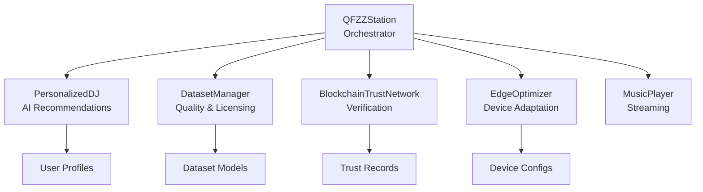

# QFZZ: The Pulse of the Quantum Realm

<div class="hero-banner" markdown>
**AI Radio for the Individual** — Personalized, Secure, Decentralized
</div>

## 🎵 Welcome to the Future of Music

QFZZ reimagines radio broadcasting for the modern era, combining cutting-edge AI personalization with quantum-inspired security and edge computing optimization. Every listener gets their own unique station, powered by agentic AI that learns and evolves with their tastes.

!!! success "Revolutionary Features"
    - **🤖 Agentic AI DJ** - Learns your preferences and curates perfect playlists
    - **🔒 Quantum Security** - Blockchain-based trust network for content verification
    - **⚡ Edge Optimization** - Seamless streaming across all devices
    - **🎯 Personalized Experience** - Every station is unique to each listener
    - **🌐 Open & Ethical** - Licensed datasets, transparent algorithms

## What Makes QFZZ Different?

### Personalized DJ with Agentic AI

Unlike traditional radio or simple recommendation engines, QFZZ employs an **agentic AI DJ** that:

- **Learns** from your listening patterns and feedback
- **Adapts** to your mood and context in real-time
- **Explores** new music while respecting your taste profile
- **Balances** familiarity with discovery using configurable exploration factors

```python
from qfzz import QFZZStation, StationConfig

# Create your personalized station (required station_id on live tip)
config = StationConfig(
    station_id="qfzz",
    station_name="My Quantum Station",
    enable_blockchain=True,
    enable_edge_optimization=True,
)

station = QFZZStation(config)
station.start()

# Add yourself as a listener
station.add_listener(
    user_id="you",
    preferences={
        'genres': {'rock': 0.8, 'jazz': 0.6},
        'discovery_factor': 0.2  # 20% exploration
    }
)

# Get your personalized playlist
playlist = station.generate_playlist("you")
```

### Blockchain Trust Network

Every piece of content in QFZZ is verified through our **quantum-inspired blockchain trust network**:

- Immutable verification records
- Transparent trust scores for content and creators
- Community-driven quality control
- Protection against manipulation and fraud

### Edge Computing Optimization

QFZZ automatically optimizes streaming for your device and network conditions:

- Smart quality adjustment based on bandwidth
- Battery-aware streaming for mobile devices
- Intelligent caching and prefetching
- Hardware acceleration when available

## Quick Start

### Installation

=== "pip"
    ```bash
    pip install qfzz
    ```

=== "conda"
    ```bash
    conda install -c conda-forge qfzz
    ```

=== "From Source"
    ```bash
    git clone https://github.com/yourusername/qfzz.git
    cd qfzz
    pip install -e .
    ```

### Your First Station

Create a simple QFZZ station in under 10 lines:

```python
from qfzz import QFZZStation, StationConfig

# Configure and start station (kwargs match live StationConfig)
config = StationConfig(
    station_id="qfzz",
    station_name="My First Station",
)
station = QFZZStation(config)
station.start()

# Add listener and generate playlist
station.add_listener(user_id="user_1")
playlist = station.generate_playlist("user_1")

# Play music!
for track in playlist:
    print(f"🎵 Now playing: {track['title']} by {track['artist']}")
```

## Architecture Overview

QFZZ is built on six core components that work together seamlessly:



## Key Features

### 🎧 Personalized DJ

The **PersonalizedDJ** component uses sophisticated machine learning to understand your preferences:

- Multi-dimensional taste profiling (genre, artist, mood, energy)
- Real-time adaptation to feedback
- Discovery factor for serendipitous recommendations
- Genre similarity mapping for intelligent exploration

[Learn more →](features/personalized-dj.md)

### 🔐 Quantum Security

Our **BlockchainTrustNetwork** provides immutable content verification:

- Tamper-proof trust records
- Proof-of-work mining for record integrity
- Dynamic trust scoring based on verifications and reports
- Creator reputation tracking

[Learn more →](features/quantum-security.md)

### 📊 Dataset Management

The **DatasetManager** ensures quality and ethical content:

- Comprehensive quality scoring (metadata, consistency, diversity)
- License validation and compatibility checking
- Support for CC-BY, CC-BY-SA, CC0, and custom licenses
- Automated quality assessment

[Learn more →](features/dataset-management.md)

### ⚡ Edge Optimization

The **EdgeOptimizer** adapts streaming for any device:

- Device capability detection and profiling
- Network-aware quality adjustment
- Battery-conscious streaming modes
- Intelligent caching strategies

[Learn more →](features/edge-optimization.md)

## Use Cases

### For Listeners

- **Personalized Radio**: Your own station that knows your taste
- **Music Discovery**: Find new artists while staying in your comfort zone
- **Multi-Device**: Seamless experience across phone, tablet, desktop
- **Offline Mode**: Intelligent caching for listening anywhere

### For Content Creators

- **Trust Building**: Build reputation through blockchain verification
- **Fair Distribution**: Transparent content licensing and attribution
- **Quality Metrics**: Understand how your content performs
- **Community Feedback**: Direct connection with your audience

### For Researchers

- **Music Recommendation**: Study state-of-the-art personalization algorithms
- **Trust Systems**: Explore blockchain applications in media
- **Edge Computing**: Investigate adaptive streaming optimization
- **Dataset Quality**: Research music dataset evaluation metrics

## Technical Highlights

### Modern Python Architecture

- **Type-Annotated**: Full type hints for better IDE support
- **Modular Design**: Clean separation of concerns
- **Extensible**: Easy to add new components and features
- **Well-Tested**: Comprehensive test coverage

### Research-Backed

QFZZ incorporates insights from:

- Music information retrieval (MIR) research
- Recommendation systems literature
- Blockchain consensus mechanisms
- Edge computing optimization strategies

### Production-Ready

- Robust error handling and logging
- Configuration management
- Performance optimization
- Scalable architecture

## Community & Support

### Documentation

- **[Getting Started Guide](getting-started.md)** - Begin your QFZZ journey
- **[Architecture Overview](architecture/overview.md)** - Understand the system design
- **[API Reference](api-reference/station.md)** - Complete API documentation
- **[Research](research/gaps-analysis.md)** - Academic foundations and research gaps

### Contributing

QFZZ is open source and welcomes contributions! See our [Contributing Guide](guides/contribution.md) for:

- Code style guidelines
- Development setup
- Testing requirements
- Pull request process

### Get Help

- **GitHub Issues**: Bug reports and feature requests
- **Discussions**: Questions and community support
- **Discord**: Real-time chat with developers and users

## What's Next?

Explore the documentation to learn more:

1. **[Getting Started](getting-started.md)** - Install and create your first station
2. **[Architecture Overview](architecture/overview.md)** - Understand how QFZZ works
3. **[Feature Deep Dives](features/personalized-dj.md)** - Explore specific capabilities
4. **[API Reference](api-reference/station.md)** - Complete technical documentation
5. **[Roadmap](roadmap.md)** - See what's coming next

---

<div class="cta-section" markdown>
**Ready to build your quantum-powered radio station?**

[Get Started →](getting-started.md){ .md-button .md-button--primary }
[View on GitHub →](https://github.com/yourusername/qfzz){ .md-button }
</div>
